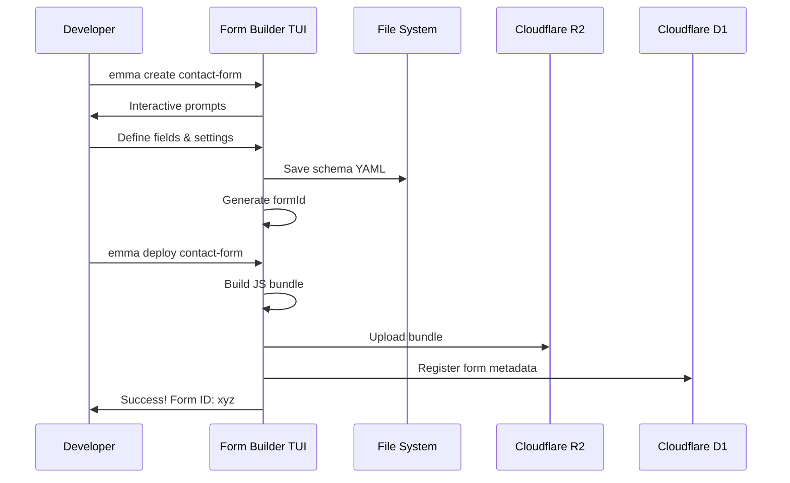
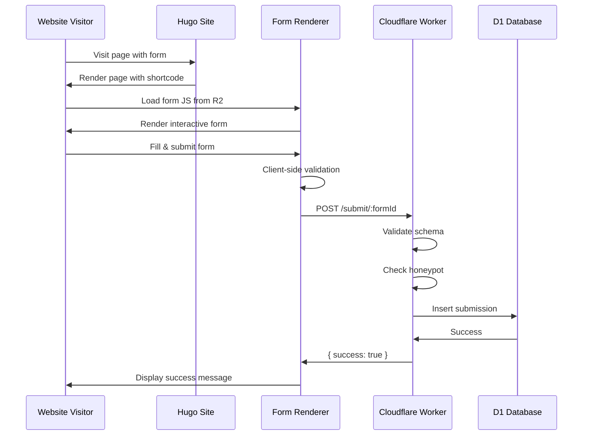

# Technical Architecture

**Document Number:** 02  
**Date:** October 7, 2025  
**Status:** In Progress  
**Previous:** [01-project-foundation.md](./01-project-foundation.md)

## 1. System Overview

Emma is a distributed system consisting of four main components that work together to enable embeddable forms for Hugo websites.

```mermaid
graph TB
    subgraph Development Time
        TUI[Form Builder TUI]
        TUI --> |generates| SCHEMA[Form Schema YAML/JSON]
        TUI --> |builds & uploads| R2[Cloudflare R2]
    end

        FORM --> |submits data| WORKER[Cloudflare Worker API]
        WORKER --> |validates & stores| D1[Cloudflare D1 Database]
        USER --> |visits| HUGO
        USER --> |fills & submits| FORM
    end

    style TUI fill:#e1f5ff
    style WORKER fill:#c8e6c9
    style D1 fill:#fff9c4
```

## 2. Component Details

### 2.1 Form Builder TUI

**Purpose:** Command-line tool for creating, managing, and deploying forms.

**Key Responsibilities:**


**Technology:**


**Commands:**
**Technology:**
- TypeScript with ES2022 modules
- Inquirer.js for interactive prompts
- Commander.js for CLI commands  
- Express.js for local development server
- fs-extra for file operations
- js-yaml for schema storage

**Implementation Status:** ✅ **COMPLETE** (Local Development Ready)

**Local Development Features:**
- Form storage in `~/.emma/` directory (YAML format)
- JavaScript bundle generation with embedded schemas
- Local Express.js server for testing
- Form preview pages with live testing
- API endpoints for form submissions
- Honeypot spam protection
- Support for all 13 field types with validation

**Commands:**

```bash
emma init                    # Initialize a new form project
emma create <form-name>      # Create a new form interactively
emma build <form-id>         # Build form JS bundle
emma deploy <form-id>        # Deploy to Cloudflare R2
emma list                    # List all forms
emma preview <form-id>       # Local preview
emma delete <form-id>        # Delete a form
```
```bash
emma init                    # Initialize Emma configuration  
emma create <form-name>      # Create a new form interactively
emma build <form-id>         # Build form JavaScript bundle
emma deploy <form-id>        # Deploy to local development server
emma list [--detailed]       # List all forms
emma preview <form-id>       # Open form preview in browser
emma delete <form-id>        # Delete a form and build artifacts
```

**Form Schema Structure:**

```yaml
formId: contact-form-001
name: 'Contact Form'
version: '1.0.0'
theme: 'default'
apiEndpoint: 'https://api.example.com/submit'

fields:
  - id: name
    type: text
    label: 'Your Name'
    required: true
    validation:
      minLength: 2
      maxLength: 100

  - id: email
    type: email
    label: 'Email Address'
    required: true
    validation:
      pattern: 'email'

  - id: message
    type: textarea
    label: 'Message'
    required: true
    validation:
      minLength: 10
      maxLength: 1000

settings:
  submitButtonText: 'Send Message'
  successMessage: "Thank you! We'll be in touch soon."
  errorMessage: 'Something went wrong. Please try again.'
  honeypot:
    enabled: true
    fieldName: 'website'
```

### 2.2 Form Renderer (JavaScript Library)

**Purpose:** Client-side library that renders forms and handles submissions.

**Key Responsibilities:**

- DOM manipulation and form rendering
- Client-side validation
- AJAX submission handling
- Error display and success messages
- Theme application

**Technology:**

- TypeScript compiled to ES5+ JavaScript
- No framework dependencies (vanilla JS)
- Bundle size target: < 15KB gzipped

**API:**

```javascript
// Generated bundle structure
(function (window) {
  window.EmmaForm = window.EmmaForm || {};

  window.EmmaForm.render({
    formId: 'contact-form-001',
    containerId: 'embeddable-form-contact-form-001',
    schema: {
      /* form schema */
    },
    theme: {
      /* CSS theme */
    },
    apiEndpoint: 'https://api.example.com/submit/contact-form-001',
  });
})(window);
```

**Features:**

- Progressive enhancement (works without JS, better with JS)
- Accessibility (ARIA labels, keyboard navigation)
- Mobile responsive
- Validation feedback in real-time
- Loading states during submission

### 2.3 Data Collection API (Cloudflare Worker)

**Purpose:** Serverless API endpoint for receiving and storing form submissions.

**Key Responsibilities:**

- Receive POST requests with form data
- Validate against form schema
- Honeypot spam detection
- Rate limiting
- Data persistence to D1
- CORS handling

**Technology:**

- TypeScript
- Cloudflare Workers
- Cloudflare D1 (SQLite)
- Hono or itty-router for routing

**API Endpoints:**

```
POST /submit/:formId
Content-Type: application/json

Request Body:
{
  "formId": "contact-form-001",
  "data": {
    "name": "John Doe",
    "email": "john@example.com",
    "message": "Hello!"
  },
  "meta": {
    "timestamp": "2025-10-07T12:00:00Z",
    "userAgent": "Mozilla/5.0...",
    "referrer": "https://example.com/contact"
  }
}

Response (Success):
{
  "success": true,
  "submissionId": "sub_abc123xyz"
}

Response (Error):
{
  "success": false,
  "error": "Invalid email format",
  "field": "email"
}
```

**Database Schema (D1):**

```sql
-- Forms table
CREATE TABLE forms (
  id TEXT PRIMARY KEY,
  name TEXT NOT NULL,
  schema TEXT NOT NULL, -- JSON schema
  version TEXT NOT NULL,
  created_at INTEGER NOT NULL,
  updated_at INTEGER NOT NULL,
  active INTEGER DEFAULT 1
);

-- Submissions table
CREATE TABLE submissions (
  id TEXT PRIMARY KEY,
  form_id TEXT NOT NULL,
  data TEXT NOT NULL, -- JSON data
  meta TEXT, -- JSON metadata (IP, user agent, etc)
  created_at INTEGER NOT NULL,
  FOREIGN KEY (form_id) REFERENCES forms(id)
);

-- Create indexes for performance
CREATE INDEX idx_submissions_form_id ON submissions(form_id);
CREATE INDEX idx_submissions_created_at ON submissions(created_at);
```

**Security Measures:**

- Rate limiting: 5 requests per minute per IP
- Honeypot field validation
- Schema validation (reject unknown fields)
- Input sanitization
- CORS restrictions
- HTTPS only

### 2.4 Hugo Module

**Purpose:** Simple integration for Hugo websites.

**Key Responsibilities:**

- Render form container
- Inject script tag with correct URL
- Handle configuration options

**Implementation:**

```html
{{/* layouts/shortcodes/embed-form.html */}} {{- $formId := .Get 0 -}} {{-
$class := .Get "class" | default "" -}} {{- $cdnUrl := site.Params.emma.cdnUrl |
default "https://forms.example.com" -}} {{- if $formId -}}
<div
  id="embeddable-form-{{ $formId }}"
  class="emma-form-container {{ $class }}"
  data-form-id="{{ $formId }}"
></div>
<script
  src="{{ $cdnUrl }}/{{ $formId }}.js"
  async
  defer
  data-emma-form="{{ $formId }}"
></script>
<noscript>
  <p>
    This form requires JavaScript to function. Please enable JavaScript or
    <a href="mailto:contact@example.com">contact us directly</a>.
  </p>
</noscript>
{{- else -}} {{- errorf "The 'embed-form' shortcode requires a formId as the
first parameter." -}} {{- end -}}
```

**Usage in Hugo:**

```markdown
---
title: Contact Us
---

# Get in Touch

We'd love to hear from you!



Or:


```

**Configuration (hugo.toml):**

```toml
[params.emma]
  cdnUrl = "https://forms.yourdomain.com"
```

## 3. Data Flow

### 3.1 Form Creation Flow



### 3.2 Form Submission Flow



## 4. Error Handling

### 4.1 Form Builder Errors

- Invalid schema format → Show validation errors
- Network failure during deployment → Retry with exponential backoff
- Authentication failure → Prompt for credentials

### 4.2 Runtime Errors

- Form JS fails to load → Show fallback message
- API submission fails → Show user-friendly error, allow retry
- Validation errors → Highlight fields with specific messages

### 4.3 API Worker Errors

- Invalid form ID → 404 Not Found
- Schema mismatch → 400 Bad Request with details
- Rate limit exceeded → 429 Too Many Requests
- Server error → 500 with generic message (log details)

## 5. Testing Strategy

### 5.1 Unit Tests

- Form builder: Schema validation, build process
- Form renderer: Field rendering, validation logic
- API worker: Request handling, validation, database operations

### 5.2 Integration Tests

- End-to-end form submission flow
- Hugo shortcode rendering
- Deployment pipeline

### 5.3 Performance Tests

- Bundle size limits
- API response time (< 200ms p95)
- Database query performance

## 6. Security Considerations

- **Input Validation:** Server-side validation for all fields
- **Rate Limiting:** Prevent abuse and DoS
- **CORS:** Restrict to allowed domains
- **Honeypot:** Detect bot submissions
- **Data Sanitization:** Prevent XSS and injection
- **HTTPS Only:** All communication encrypted
- **API Keys:** Secure authentication for TUI

## 7. Scalability

- **Cloudflare Workers:** Auto-scales globally
- **D1 Database:** SQLite at the edge
- **R2 Storage:** Unlimited static assets
- **CDN:** Global distribution of form JS

## 8. Monitoring & Observability

- Worker logs via Cloudflare dashboard
- Submission rate monitoring
- Error tracking (4xx, 5xx responses)
- Performance metrics (response times)
- Database size monitoring

## 🎯 Next Implementation Phases

### Phase 1: Form Renderer (Start Here!)

**Why first?** It's the core of the system.

Tasks:

- Create TypeScript types from schema
- Build rendering engine (vanilla JS)
- Add validation logic
- Implement themes
- Bundle and optimize

### Phase 2: API Worker

**Why second?** Backend for form submissions.

Tasks:

- Set up Cloudflare Worker
- Create submission endpoint
- Validate incoming data
- Save to D1 database
- Add rate limiting

### Phase 3: Form Builder TUI

**Why third?** Brings it all together.

Tasks:

- Build CLI with Commander.js
- Interactive form creation
- Build pipeline
- Cloudflare deployment
- Form management

### Phase 4: Polish

**Why last?** Make it production-ready.

Tasks:

- Write tests
- Example Hugo site
- Documentation site
- Tutorials

---

**Next:**
