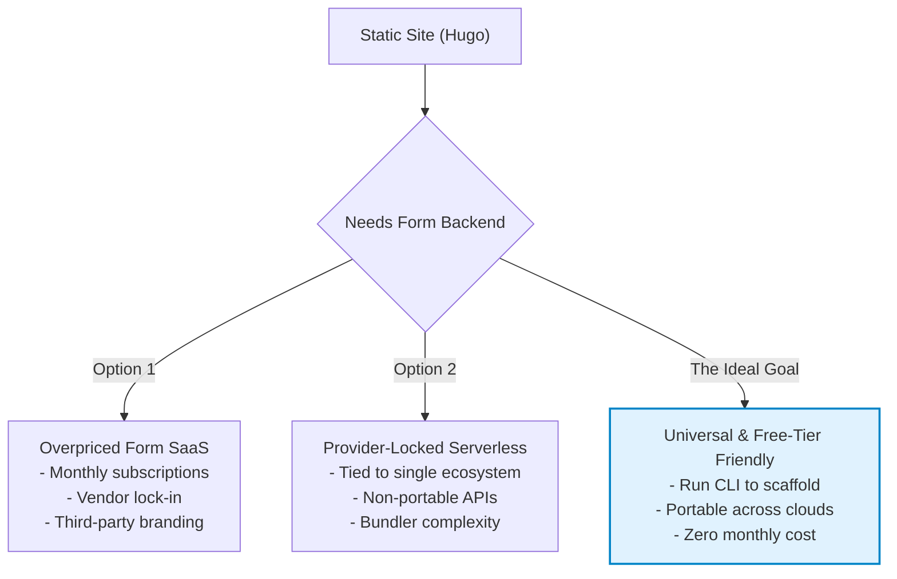
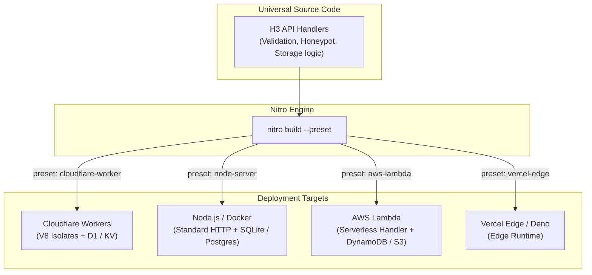
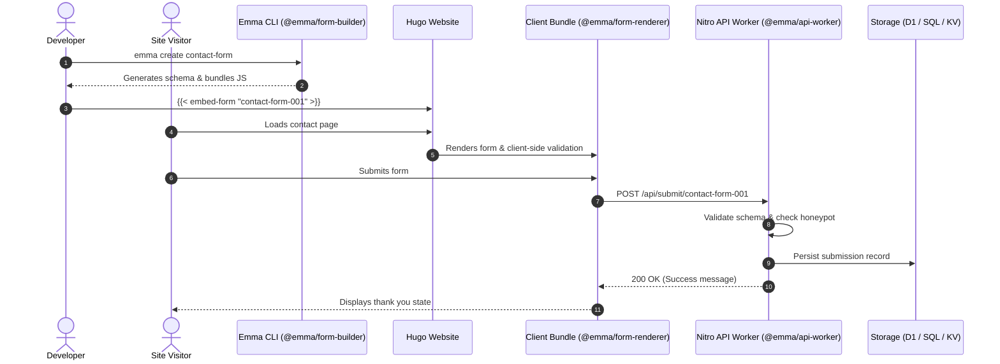

Every developer who maintains side projects knows the feeling: you spin up a clean, lightning-fast static website using Hugo. It costs practically nothing to host on GitHub Pages or Cloudflare Pages, loads in milliseconds, and requires zero maintenance. 

Then comes the inevitable requirement: **"I need a contact form."**

Suddenly, you are faced with a frustrating dilemma. The form-backend and email marketing tools currently on the market are either ridiculously overpriced for low-traffic hobby sites, push you into recurring subscriptions, or slap third-party branding all over your pages. 

I wanted something simple: whenever I launch a new static website and need a contact page, I just want to run a CLI command and have the form ready. No high-traffic enterprise baggage, no monthly fees, and a solution that comfortably fits inside the free tier of almost any cloud provider—from **Cloudflare to AWS, GCP, Azure, or DigitalOcean**.

Here is the story of how that search led me down the rabbit hole of WebAssembly, storage hurdles, and ultimately the discovery of **UnJS** and **Nitro**—and how they became the foundation for my open-source project, **Emma**.

---

## The Provider Lock-in Trap & The Storage Dilemma

My initial thought was to look at Cloudflare's serverless offering. Between Cloudflare Workers, D1 (SQL database), and KV, you get an incredible free tier. 

However, building a solution tightly coupled to Cloudflare felt restrictive. Committing to proprietary APIs and platform-specific bindings creates vendor lock-in. What if someone wants to host their form backend on an AWS Lambda function, a DigitalOcean droplet, or a self-hosted Node/Docker container?



At first, I even considered compiling a form runtime to **WebAssembly (WASM)**. But while WASM solves portable compute, it doesn't solve **state and persistence**. 

When a visitor submits a contact form:
1. The payload needs validation and spam protection (honeypots and rate limiting).
2. The submission must be persisted somewhere—whether that is SQLite/D1, Postgres, a KV store, or an S3/R2 blob store (after all, we don't care that much about the underlying storage engine as long as we can reliably store and retrieve it later).
3. An email notification or webhook should be dispatched.

How do you write a single backend codebase that handles HTTP routing, runs anywhere, talks to heterogeneous storage backends, and compiles to different platform targets without drowning in complex bundler configurations?

That’s when **Nitro** and **UnJS** came into my line of sight.

---

## Enter UnJS and Nitro: Universal JavaScript Done Right

If you haven't explored the [UnJS](https://unjs.io/) ecosystem yet, it represents one of the most elegant architectural movements in modern JavaScript and TypeScript tooling.

### What is UnJS?
**UnJS** (Unified JavaScript Tools) is a collection of modular, compact, zero-dependency utility libraries designed from the ground up to be **runtime-agnostic**. 

Instead of writing code that assumes a standard Node.js environment (with `fs`, `http`, or global `process`), UnJS packages are built to run seamlessly across:
- **Node.js & Bun**
- **Deno**
- **Cloudflare Workers & Vercel Edge** (V8 Isolates)
- **AWS Lambda & GCP Cloud Functions**
- **Browsers & Web Workers**

Some of the standout packages in the ecosystem include:
- **`h3`**: An ultra-fast, composable, runtime-agnostic HTTP framework (the engine underneath Nitro).
- **`unstorage`**: A unified key-value and blob storage layer with 30+ driver adapters (Memory, LocalStorage, Redis, Cloudflare KV/R2, S3, MongoDB, etc.).
- **`unenv`**: Configurable polyfills that let Node.js modules run in non-Node environments like Cloudflare Workers.
- **`consola`**, **`c12`**, **`ofetch`**: Universal logging, configuration loaders, and HTTP clients.

### What is Nitro?
**[Nitro](https://nitro.build/)** is the next-generation web server engine built on top of UnJS (famous for powering Nuxt, but completely usable as a standalone backend framework).

Nitro acts as both a **runtime framework** and a **smart build system**:



1. **Preset-driven Bundling:** You write your API routes once using standard Web Standards (`Request` / `Response` or `h3` handlers). With a single flag (`--preset cloudflare-worker`, `--preset node-server`, `--preset aws-lambda`), Nitro bundles, treeshakes, and polyfills your app for that target.
2. **Zero-Config Storage:** Through `unstorage`, caching and persistence can switch from in-memory (for local development) to Cloudflare KV/D1 or AWS DynamoDB/S3 with a simple configuration change.
3. **Instant Cold Starts & Tiny Footprints:** Because it strips out unnecessary runtimes and polyfills, the generated bundles are tiny (~90 KB) and cold-start in under 10ms on edge networks.

---

## Bringing It to Life: Project Emma

Armed with Nitro and UnJS, I set out to build **Emma**—an embeddable form system tailored for Hugo (and other static sites) with a developer-first CLI.

### The System Architecture



### The Developer Experience

Instead of signing up for dashboards and copying complex embed scripts, the entire workflow lives in your terminal:

```bash
# 1. Initialize Emma in your Hugo site
$ emma init

# 2. Interactively create your contact form
$ emma create contact-form
? Form display name: Contact Us
? Select a theme: default
? Add field 1: Text Input > Your Name (required)
? Add field 2: Email > Email Address (required)
? Add field 3: Textarea > Message (required)
? Enable spam protection (honeypot)? Yes
✓ Form created: contact-form-001

# 3. Build & test locally
$ emma build contact-form-001
$ emma deploy contact-form-001
$ emma preview contact-form-001
```

In your Hugo markdown content, you simply drop the shortcode:

```markdown
---
title: "Get in Touch"
---

Feel free to reach out to us using the form below:


```

### How Nitro Made the Backend Truly Multi-Provider

Under the hood of `@emma/api-worker`, the API endpoint is written universally using `h3`:

```typescript
// packages/api-worker/src/server.ts
import { createApp, defineEventHandler, readBody, createError } from 'h3';
import { SubmissionSchema } from './validation';

const app = createApp();

app.use('/api/submit/:formId', defineEventHandler(async (event) => {
  const body = await readBody(event);
  
  // 1. Zod Validation & Honeypot Check
  const result = SubmissionSchema.safeParse(body);
  if (!result.success || body._gotcha) {
    throw createError({ statusCode: 400, message: 'Invalid submission' });
  }

  // 2. Access the abstracted repository injected into event context
  const repo = event.context.submissionRepository;
  await repo.saveSubmission(event.context.params.formId, result.data);

  return { success: true, message: 'Submission received!' };
}));

export default app;
```

When building for local development or a self-hosted server:
```bash
yarn nitro build --preset node-server
```

When deploying to Cloudflare Workers:
```bash
yarn nitro build --preset cloudflare-worker
```

The exact same business logic runs locally on SQLite or in-memory, and in production on Cloudflare D1/KV, AWS Lambda, or any Node-compatible host—without changing a single route handler.

---

## State of the Experimentation & What's Next

Where does Emma stand today?

- **Local CLI Workflow:** Fully operational. Interactive form generation (13+ field types), schema validation, asset bundling, and local preview servers work smoothly.
- **Nitro & H3 Migration:** Completed. The API worker has been decoupled from Cloudflare-specific APIs into universal H3 handlers and Nitro presets.
- **Provider System:** The provider abstraction layer is modularized. The Cloudflare provider (Workers + D1 + KV) is implemented, and the architecture is ready for community drivers (Node/Docker, AWS Lambda, S3).
- **Email & Notification Engine:** Currently experimenting with provider-agnostic notification adapters (Cloudflare Email Routing, SMTP, Resend, SendGrid) so submissions can be delivered straight to your inbox without additional costs.

---

## Conclusion

You don't need a heavy SaaS subscription or vendor-locked infrastructure just to put a contact form on a personal static website. 

By combining the speed of static site generators like Hugo with the flexibility of **UnJS** and **Nitro**, we can build developer tooling that is cost-free, privacy-friendly, and portable across any cloud.

If you are building full-stack JavaScript utilities, APIs, or edge microservices in 2026, give **Nitro** and the **UnJS ecosystem** a spin—it fundamentally changes how you think about write-once, deploy-anywhere code.
